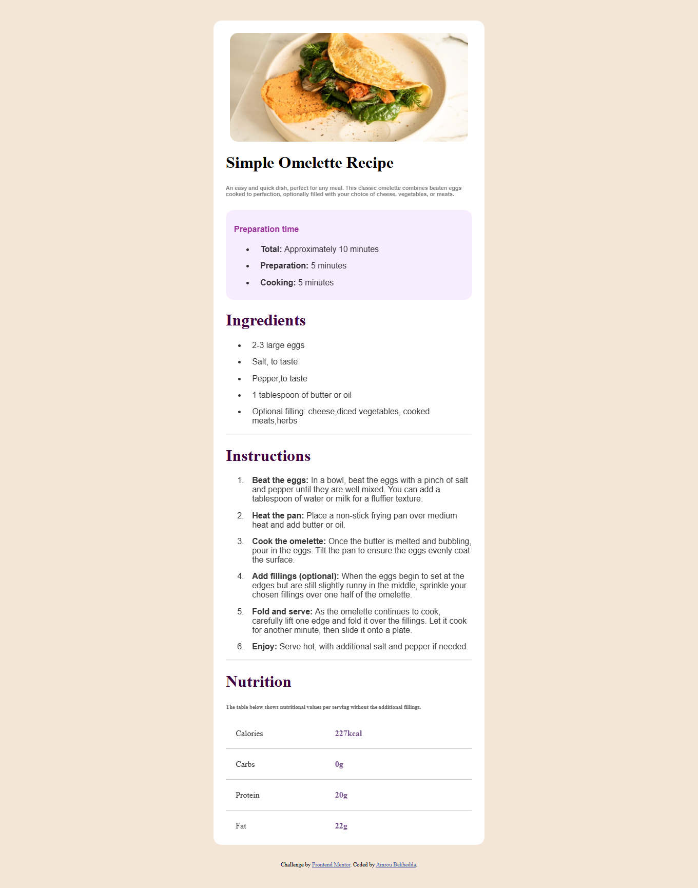

# Frontend Mentor - Recipe page solution

This is a solution to the Frontend Mentor Recipe page challenge .

## Table of contents

- [Overview](#overview)
  - [Screenshot](#screenshot)
  - [Links](#links)
- [My process](#my-process)
  - [Built with](#built-with)
  - [What I learned](#what-i-learned)
  - [Useful resources](#useful-resources)
- [Author](#author)
- [Acknowledgments](#acknowledgments)

## Overview
Recipe page project using HTML & CSS .

### Screenshot



### Links

- Solution URL: [Github](https://github.com/Amoru-Bek/Recipe-page)
- Live Site URL: [Live Site]([https://your-live-site-url.com](https://amoru-bek.github.io/Recipe-page/))

## My process

### Built with

- Semantic HTML5 markup
- CSS custom properties
- Flexbox
- CSS Grid
- Mobile-first workflow
- CSS Media query
  


### What I learned

I developed my CSS styling techniques and learned how to use Media queries to create dynamic web pages .

To see how you can add code snippets, see below:

```html
<div class="purple-card">
  <h4>Preparation time</h4>
  <ul>
    <li><b>Total: </b>Approximately 10 minutes</li>
    <li><b>Preparation: </b>5 minutes</li>
    <li><b>Cooking: </b>5 minutes</li>
  </ul>
</div>
```
```css
@media (max-width: 768px){
    .card{
        width: auto;
        max-width: 450px;
    }
}
@media (min-width: 768px){
    .card{
        width: auto;
        max-width: 30rem;
    }
}
}
```


### Useful resources

- [Free CSS tutorials whit W3schools](https://www.w3schools.com/Css/default.asp) 
- [Bootstrap Framework](https://getbootstrap.com/) - An amazing Css Framework.
- [Recipe page challenge on Frontend Mentor](https://www.frontendmentor.io/challenges/recipe-page-KiTsR8QQKm) - challenges help you improve your coding skills by building realistic projects.

## Author

- Linkedin - [Amrou Bekhedda](https://www.linkedin.com/in/amrou-bekhedda-99b314341/)
- Frontend Mentor - [@Amrou Bekhedda](https://www.frontendmentor.io/profile/Amoru-Bek)
- Github - [@Amoru-Bek](https://github.com/Amoru-Bek)

## Acknowledgments

Thanks [Frontend Mentor](https://www.frontendmentor.io/)
